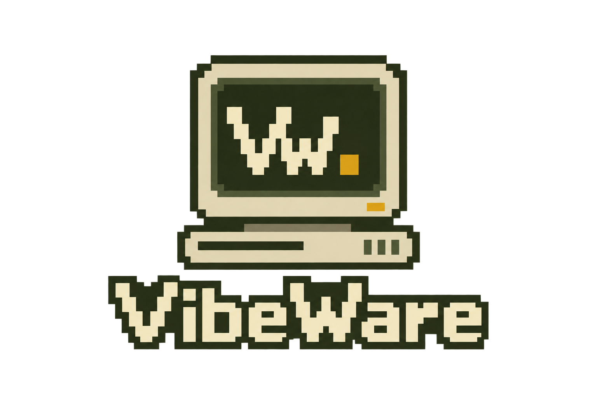
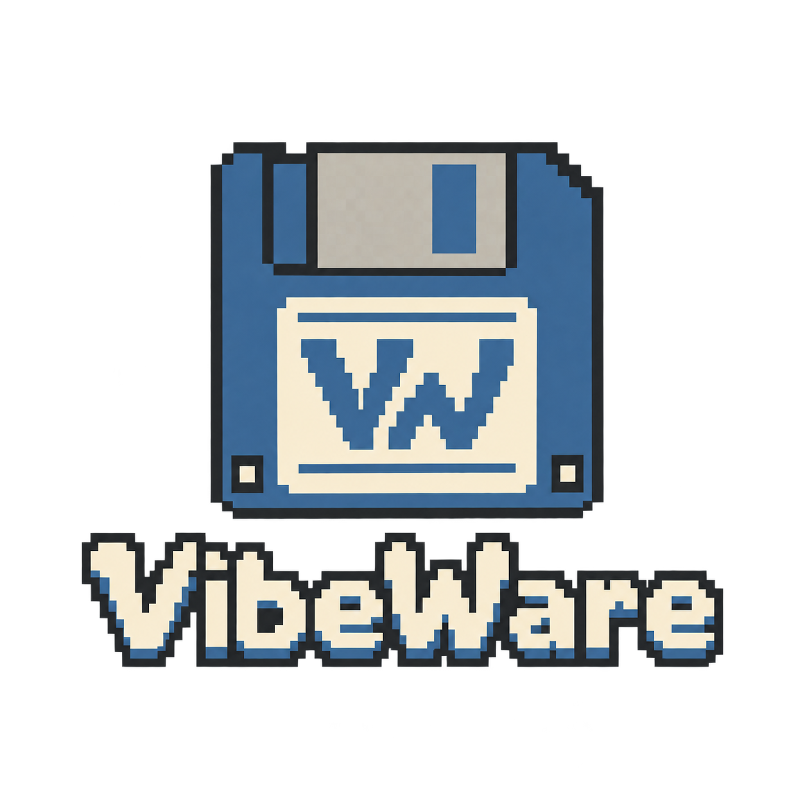
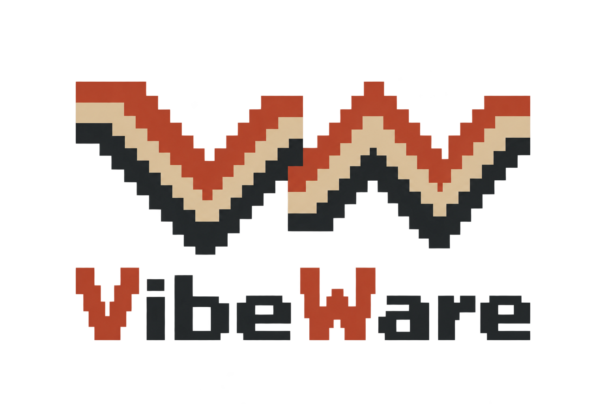
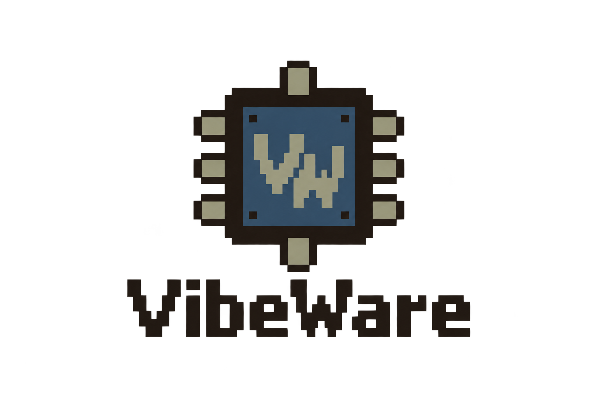
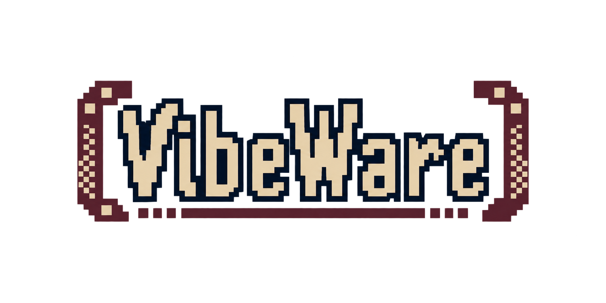
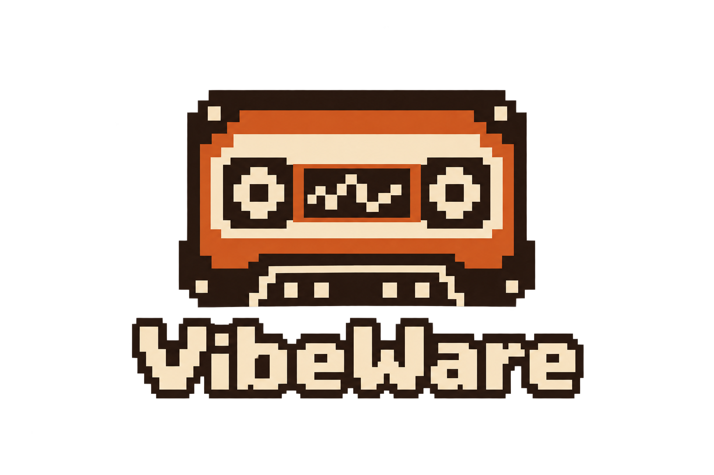
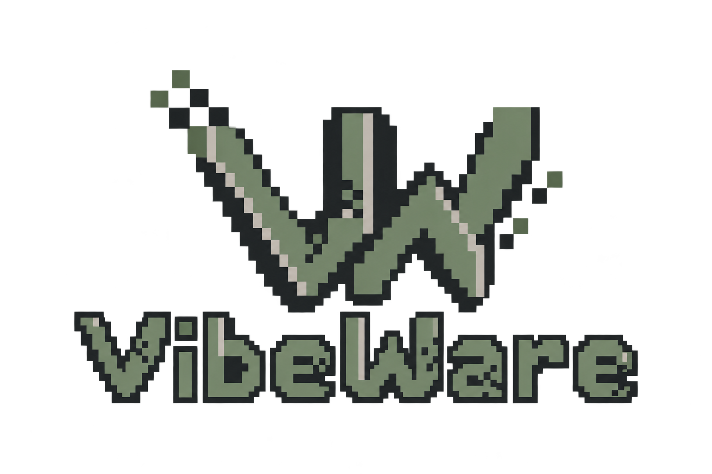

# VibeWare logo proposals

These are the eight original concepts generated for the brief: 1980s cyber computing, lo-fi and pixel art, explicitly without neon art. The originals are preserved unchanged, including imperfections. Umberto approved **02 Floppy** on 5 October 2026; all other proposals are archived, not approved.

The exact approved attachment is available in the [brand guidelines](../../../Branding/Brand%20guidelines.md). See the [prompts](PROMPTS.md) and [provenance manifest](manifest.json) for the original requests and file checksums.

## 01 Terminal

Pixel terminal and command-line identity. Archived proposal.

## 02 Floppy

**Selected direction.** Denim-blue floppy disk, cream label and VW monogram. This is the original generated file; the exact attachment approved by Umberto is kept separately under Branding.

## 03 Digital wave

Stepped V and W diagonals with terracotta and sand. Archived proposal.

## 04 Chip

Retro microchip badge and industrial bitmap lettering. Archived proposal.

## 05 BBS

Typographic bulletin-board identity with pixel brackets. Archived proposal.

## 06 Data tape

Home-computer cassette identity with a stepped waveform. Archived proposal.

## 07 Industrial cyber

Angular pixel lettering and a compact VW glyph. Archived proposal.

## 08 Modular monogram

Square VW pixel monogram and compact wordmark. Archived proposal.

