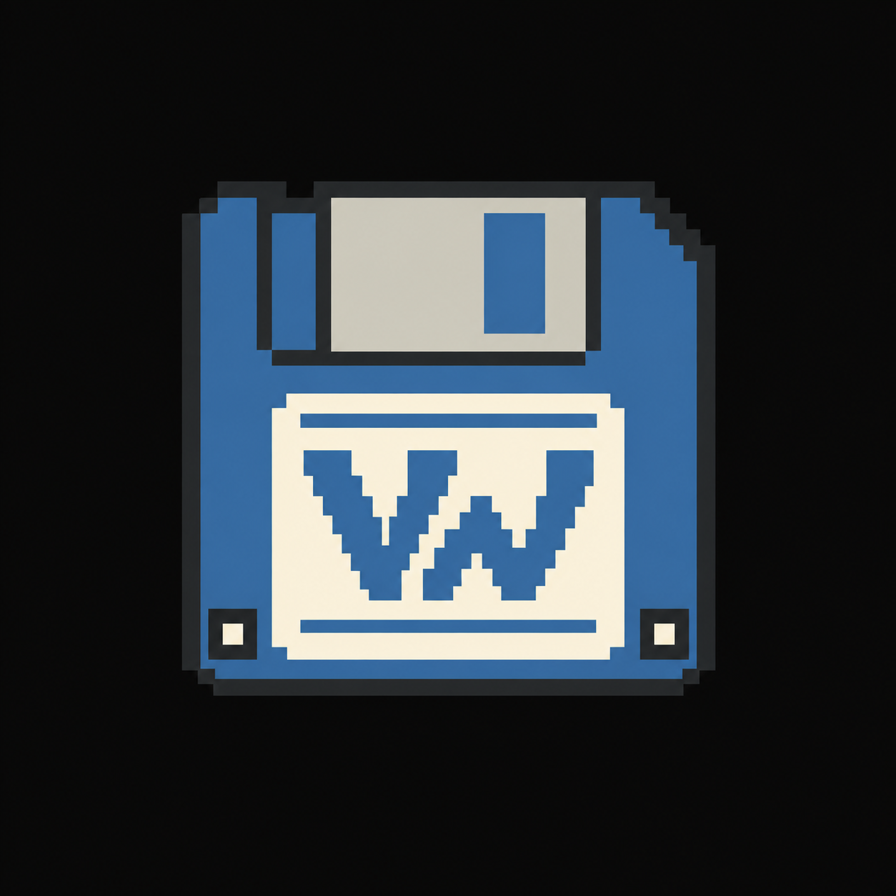
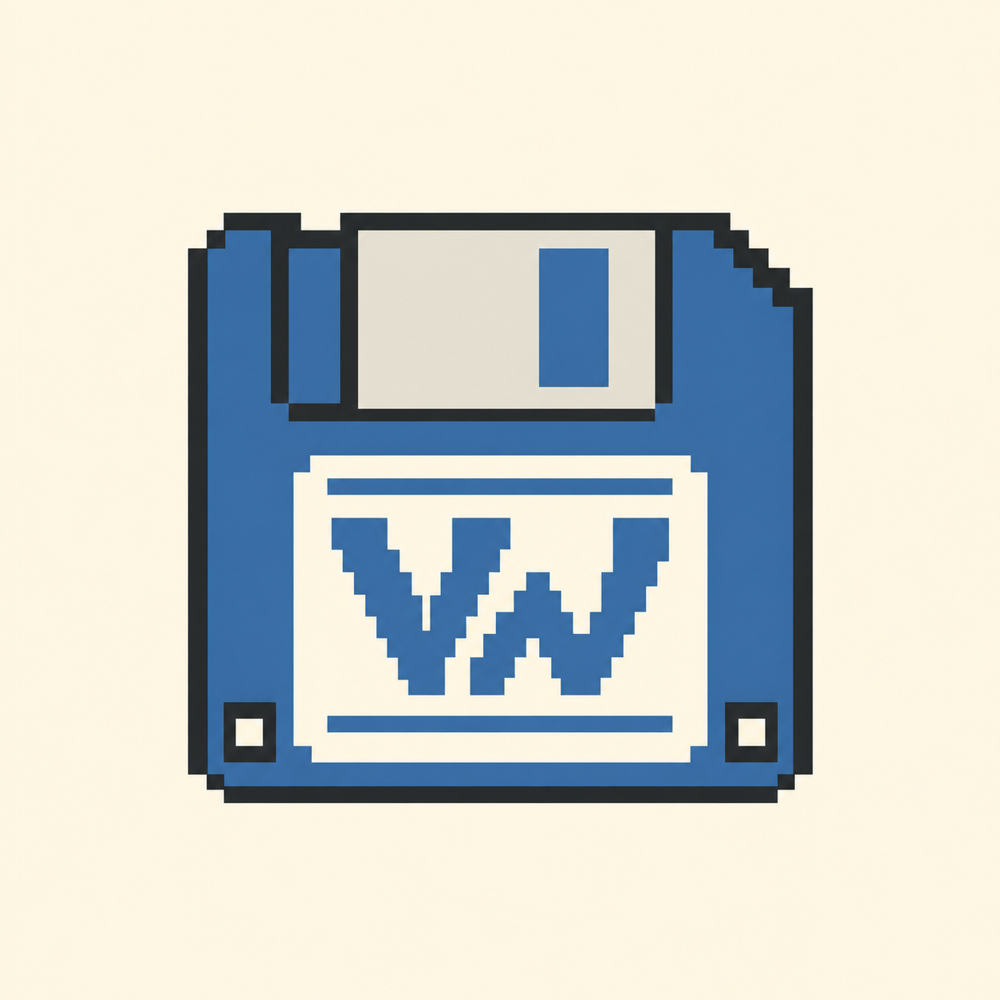
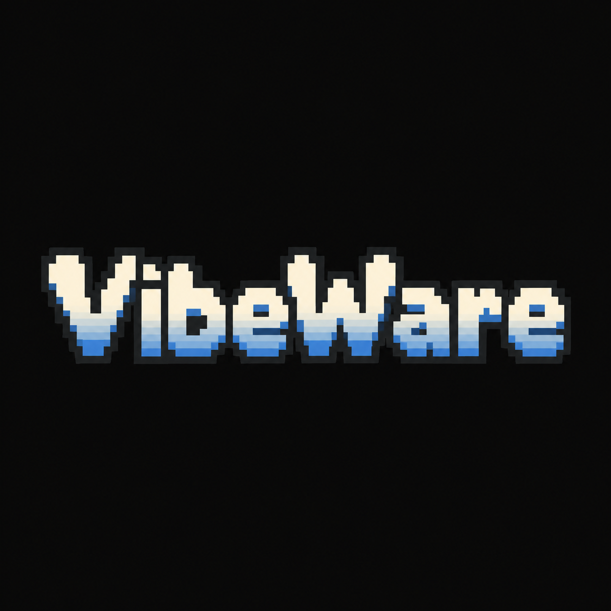
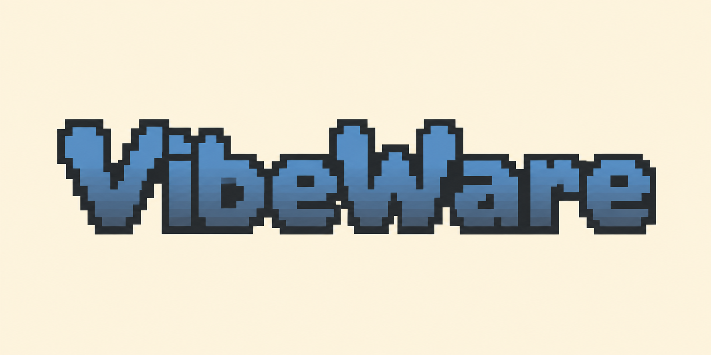
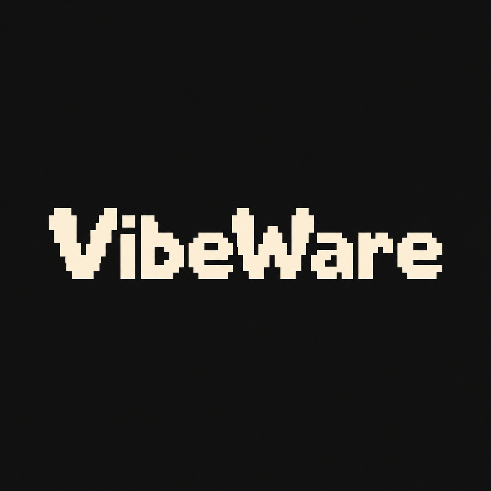
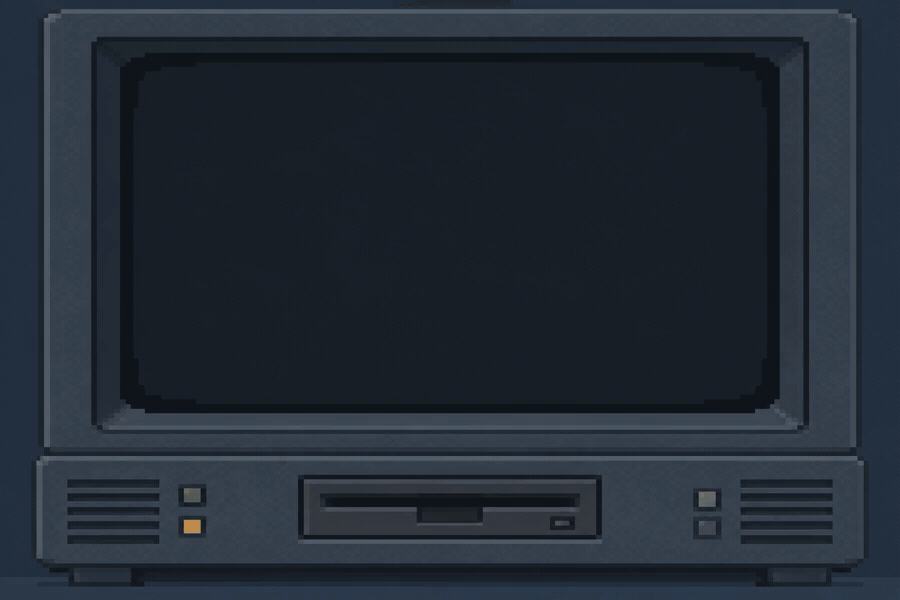

# VibeWare press kit

## Identity at a glance

VibeWare is Umberto Giacobbi’s label for a human-directed, AI-assisted creative and technical workflow. The primary visual is a pixel-art floppy disk with a VW monogram. The floppy is the brand symbol; the wordmark is a secondary signature for places where the name must stand alone.

**Primary tagline:** VibeWare = Human intent, AI, and plenty of tokens ;-)

**Creator:** [Umberto Giacobbi](https://umbertogiacobbi.biz)

**Related project:** [ESP32 Luna Shell](https://github.com/umbertotechnopreneur/esp32-luna-shell)

**Planned web manifesto:** <https://umbertogiacobbi.biz/vibeware> — the URL returned 404 at the last recorded verification.

## Approved primary symbol

Use the floppy symbol as the compact mark. The approved source artwork lives at [Branding/vibeware-logo.png](Branding/vibeware-logo.png). The dark and light press-kit renderings below are generated presentation assets; they do not replace the approved source artwork.

| Dark surface | Light surface |
| --- | --- |
|  |  |

## Wordmark candidates

The wordmark files are exploratory raster artwork, not a native vector master. They were generated at the available high resolution with vector-like hard-edged geometry. Before print-scale or formal vector use, redraw the selected wordmark as a manual SVG source and approve it again.

| Use | Candidate |
| --- | --- |
| Dark digital surfaces |  |
| Light digital surfaces |  |
| Small or monochrome placement |  |

## Boot animation

The GIF is an original retro home-computer boot homage: the selected floppy symbol enters a generic disk slot and the screen shows the selected VibeWare logo. It contains no Amiga mark, operating-system screen or copied interface.

## AI workflow wording

Use this wording in concise credits where appropriate:

“VibeWare may use OpenAI Codex, GitHub Copilot and AI-assisted CI/CD pipelines. Tooling and model versions vary by contributor and execution environment. Consult Git history and CI/CD logs for recorded provenance where available.”

Do not claim that all of those tools were used for a particular contribution. Do not claim that every AI-assisted contribution was reviewed.

## Tagline variants

1. VibeWare = Human intent, AI, and plenty of tokens ;-)
2. VibeWare = Human creativity, AI speed, and generously spent tokens ;-)
3. VibeWare = Human intent, AI magic, and a suspicious token bill ;-)
