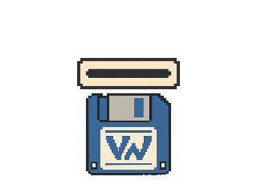

# VibeWare press kit

This page is the public reference for VibeWare identity, approved artwork, editorial language, asset provenance and reuse.

## Identity at a glance

| | |
| --- | --- |
| **Name** | VibeWare |
| **Creator** | [Umberto Giacobbi](https://umbertogiacobbi.biz) |
| **Origin** | 5 October 2026 |
| **Primary tagline** | Human intent. AI implementation. Accountable human review. |
| **Visual direction** | 1980s computing, lo-fi and pixel art; no neon |
| **Manifesto** | [umbertogiacobbi.biz/vibeware/manifesto](https://umbertogiacobbi.biz/vibeware/manifesto) |

### Short description

VibeWare is a term coined by Umberto Giacobbi and an open initiative for developers who build with AI and care about the craft. It challenges the assumption that vibe coding is synonymous with low-quality code. VibeWare openly recognizes the weaknesses of AI-generated software and keeps human judgment, testing, security review and responsibility in the process.

### Boilerplate

VibeWare identifies software shaped by human intent and executed with AI. The person guiding the work defines the purpose, makes the key decisions, evaluates the output and remains responsible for the result. The name is an invitation to judge AI-produced software by its behavior, evidence and quality rather than by the tools used to create it.

## Approved visual identity

The approved source is [Branding/vibeware-logo.png](Branding/vibeware-logo.png): a 1254 × 1254 pixel PNG with an alpha channel. It contains the denim-blue floppy, warm-cream label, VW monogram and VibeWare wordmark selected by Umberto Giacobbi.

Use **VibeWare** with capital V and W. The floppy and VW monogram form the primary compact symbol. The wordmark is a secondary signature for placements where the name must stand alone.

The visual character is rooted in 1980s computing, lo-fi graphics and pixel art. Denim blue, warm cream and dark graphite describe the direction; they are not a formal print palette. Do not introduce neon colors, glowing outlines or synthwave effects.

Preserve the approved source without cropping, stretching, recoloring or added effects. Its transparent canvas is intentional. It is raster artwork, not an SVG or vector master.

## Press assets

| Asset | Intended use | Status |
| --- | --- | --- |
| [Approved source logo](Branding/vibeware-logo.png) | Master visual reference | Approved PNG |
| [Symbol for dark surfaces](press-kit/assets/logo/vibeware-symbol-dark.png) | Compact digital placement | Press derivative |
| [Symbol for light surfaces](press-kit/assets/logo/vibeware-symbol-light.png) | Compact digital placement | Press derivative |
| [Gradient wordmark for dark surfaces](press-kit/assets/logo/vibeware-wordmark-dark-gradient.png) | Wide digital placement | Exploratory raster candidate |
| [Gradient wordmark for light surfaces](press-kit/assets/logo/vibeware-wordmark-light-gradient.png) | Wide digital placement | Exploratory raster candidate |
| [Monochrome wordmark](press-kit/assets/logo/vibeware-wordmark-mono-dark.png) | Small or restrained placement | Exploratory raster candidate |
| [Transparent floppy insertion](press-kit/assets/boot/vibeware-floppy-insert-transparent.gif) | Motion and presentation | Original GIF |

The dark and light symbols are presentation derivatives and do not replace the approved source. The wordmark candidates use hard-edged raster geometry; redraw and approve a true vector source before print-scale or formal vector use.

## Motion and reference media

The transparent 320 × 240 GIF is an original 42-frame loop. It shows the VibeWare floppy entering a generic pixel slot, passing in front of the lower bezel and disappearing progressively inside the opening. It contains no copied interface, third-party watermark, sound or baked backdrop. The animation can be rebuilt with `tools/Build-FloppyAnimation.ps1` using PowerShell, System.Drawing and FFmpeg.

A local six-second Amiga 1200 boot video was supplied as motion reference on 5 October 2026. It contains Commodore-Amiga copyright text and a MakeAGIF watermark. It informed only the general idea of a floppy moving into a slot. No source URL or redistribution licence was supplied, so the video is excluded from Git and from the public press kit. The VibeWare animation is original and is not a copy of that reference.

## Language and credits

Use the primary tagline exactly as written:

> Human intent. AI implementation. Accountable human review.

For concise project credits, use:

> Developed with AI under human direction. See the VibeWare manifesto and the project’s recorded validation evidence.

Name AI tools only when they actually contributed. Tool and model versions may vary by contributor and environment. Git history, pull requests, development disclosures and CI logs can record provenance where available; they do not prove that every contribution received the same review.

Avoid universal claims about AI use, human review, security or verified quality. A VibeWare mark expresses an approach. Each project must provide its own evidence.

## Reuse, licensing and distribution

The repository uses the [MIT License](LICENSE). Retain its copyright and permission notice in copies or substantial portions of covered material. The MIT License does not grant trademark rights in the VibeWare name or logo and does not imply endorsement, partnership or review.

The repository distributes documentation, templates and press-kit artwork. It does not distribute releases of related applications, compiled packages, AI models, private logs or user data. Related projects keep their own licences, attribution, release status and validation records.

Generated PNG and GIF assets remain raster artwork. “High resolution” does not mean SVG or vector source. Third-party reference media is excluded unless redistribution rights are established.

Earlier logo concepts, original prompts and provenance records remain in [Archive/Logo proposals/2026-10-05](Archive/Logo%20proposals/2026-10-05/). They are historical material; only the floppy direction is approved.
